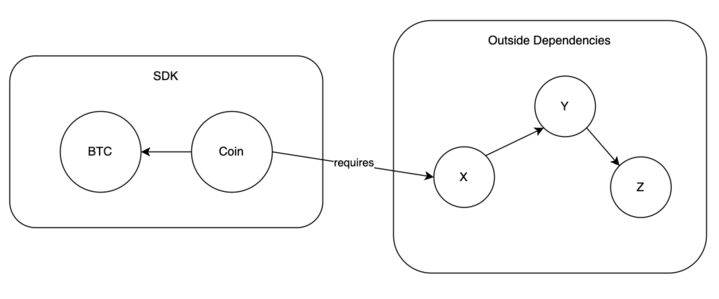

# SES Hardened Javascript Sandboxing

This repository contains a monorepo setup for experimenting with SES (Secure EcmaScript) to
create a hardened JavaScript sandboxing environment. The goal is to secure JavaScript execution
by locking down the environment and preventing unauthorized access to sensitive information and
functions.

## Packages

This monorepo includes the following packages:

- `@ses/btc`: A dummy package acting as a target for adversaries.
- `@ses/protected`: A hardened package with an unsuccessful attack from `@ses/x`.
- `@ses/unprotected`: An unhardened package with a successful attack from `@ses/x`.
- `@ses/x`: A compromised package that executes an attack, required by `@ses/protected`.
- `@ses/y`: Another compromised package that executes an attack, required by `@ses/x` (2nd degree dependency of protected/unprotected).
- `@ses/z`: Another compromised package that executes an attack, required by `@ses/y` (3rd degree dependency of protected/unprotected).



This demonstrates that Hardened JavaScript can prevent global object mutation on any hardened object, regardless of where the require call to attack said object occurs. We have proven that this holds for 1st, 2nd, and 3rd degree dependencies.

These tests can be found in:

`packages/coin/test/transitive.ts`

Other tests that assert that we are in a locked down environment can be found in:

`packages/coin/test/test.ts`

## Testing

To run all tests

```
npm run test
```

To run tests in specific module

```
npm run test --workspace @ses/{package-name}
```
